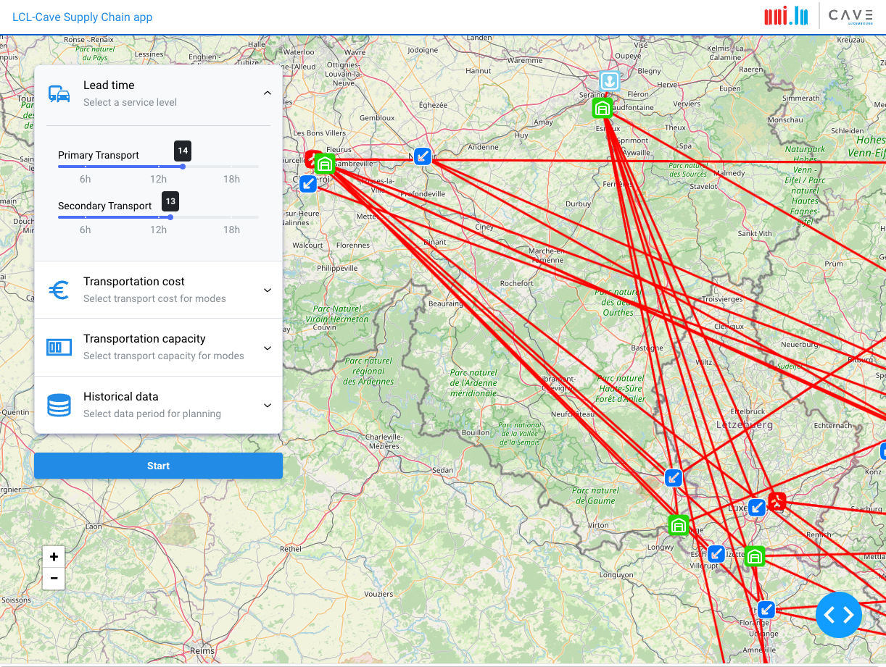

# LCL-Supply-Chain app

## About the app

- This is a sample web app for the optimization of a supply chain network consists of entry points (airports, seaports), DCs and market places.
- A supplier imports products to entry points, transports them to DCs, and then re-distributes them to market places. 
- Currently, there are eight entry points utilized for importing. There are eight DCs in the second tier assuming infinite capacity.
- The objective is to minimize cost, including running costs and transportation cost (primary and secondary).

## To-dos
- [x] Callback seperartion
- [ ] Map optimization
- [ ] Model integration

## Screenshot

